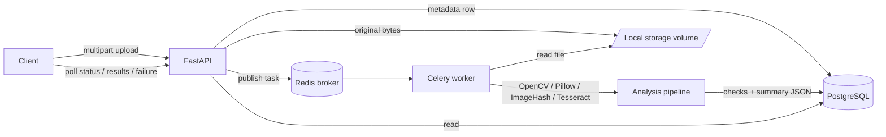
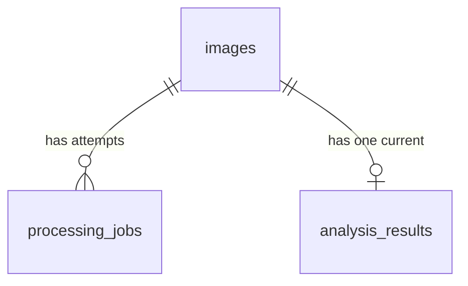

# Intelligent Media Processing Pipeline

Asynchronous backend that accepts vehicle images, stores metadata, analyses them in
background workers, and exposes APIs for processing status and structured results.

Every quality verdict is an **explicit heuristic with a confidence value**. The system is
built to say "I am not sure" rather than to fake certainty.

---

## 1. Project overview

| Capability                      | Implementation                                                                              |
| ------------------------------- | ------------------------------------------------------------------------------------------- |
| Upload + validation             | `POST /api/v1/images/upload` — magic-byte sniffing, size cap, Pillow decode                 |
| Async processing                | Celery worker on a Redis broker, single `image_processing` queue                            |
| Analysis                        | blur, brightness, dimensions, duplicate, OCR + plate validation, screenshot heuristic, EXIF |
| Persistence                     | PostgreSQL via SQLAlchemy 2.0, Alembic migrations                                           |
| Status / results / failure APIs | 4 read endpoints + `/health`                                                                |
| Tests                           | 86 Pytest tests, no external services or paid APIs required                                 |

## 2. Architecture



Layering is strict and one-directional:

```
routes  ->  services  ->  models / utils
workers ->  services  ->  models / utils
```

Routes contain no analysis logic; services contain no HTTP concerns; the worker reuses the
exact same services the API does. Both processes share one settings object and one session
factory, so there is no second source of truth for thresholds or connection strings.

## 3. Service flow

1. Client POSTs an image (`multipart/form-data`).
2. API reads the body in 256 KB chunks and aborts at the size limit — an oversized body is
   never fully buffered.
3. Content is validated by **magic bytes and a real Pillow decode**, never by extension.
4. An `images` row (status `pending`) and a `processing_jobs` row are inserted, then the
   bytes are written to `storage/<uuid>.<ext>`, then the transaction commits.
5. A Celery task is published to Redis. If Redis is unreachable, the row is marked `failed`
   with a clear reason and the client gets `503` — no job is left silently stuck at pending.
6. API returns `202` with the id and `pending`. **It never waits for analysis.**

## 4. Processing flow

```mermaid
sequenceDiagram
    participant W as Celery worker
    participant DB as PostgreSQL
    participant A as Analysis pipeline
    W->>DB: load image; skip if already completed (idempotency)
    W->>DB: status = processing, attempts += 1
    W->>A: run 7 checks (each isolated)
    A-->>W: checks[] + weighted summary
    W->>DB: status = completed, upsert analysis_results
    Note over W,DB: on failure: status = failed + public reason,<br/>retry only if the error is transient
```

Each check is wrapped so one library failure cannot destroy the whole run: a broken check
records `status: "error"` and the remaining signals are still returned, with the aggregate
confidence reduced accordingly.

## 5. Technology choices

| Choice                      | Why                                                                                                   | Rejected alternative                                                                         |
| --------------------------- | ----------------------------------------------------------------------------------------------------- | -------------------------------------------------------------------------------------------- |
| FastAPI                     | Async I/O for uploads, Pydantic contracts, free OpenAPI docs                                          | Django REST — heavier than needed                                                            |
| Celery + Redis              | Mature retry/ack semantics, `acks_late` redelivery, trivial local setup                               | RQ (weaker retries), Kafka (operational overkill), `BackgroundTasks` (dies with the process) |
| PostgreSQL + JSONB          | Relational lifecycle data plus a flexible check payload that can evolve without a migration per check | Mongo — loses the FK/transaction guarantees the job table needs                              |
| Sync SQLAlchemy             | The worker is sync and CPU-bound; one session model for API and worker                                | Async SQLAlchemy — two stacks to maintain for negligible gain                                |
| Tesseract (pytesseract)     | Installs from apt, no model download, CPU-only, small image                                           | EasyOCR — ~100 MB of PyTorch weights and a much slower cold start                            |
| OpenCV + Pillow + ImageHash | Cheap, deterministic, explainable statistics                                                          | A trained CNN — no labelled dataset, and unexplainable output for a fraud-review workflow    |
| Local filesystem            | Zero-credential setup for a take-home                                                                 | S3 (see trade-offs)                                                                          |

## 6. Database design



**images** — `id (uuid pk)`, `original_filename`, `stored_filename`, `storage_path`,
`content_type`, `file_size`, `width`, `height`, `image_hash`, `status`, `failure_reason`,
`created_at`, `updated_at`.
Indexes: `status`, `(image_hash, created_at)` for the duplicate scan, `(status, created_at)`.

**processing_jobs** — `id`, `image_id (fk cascade)`, `status`, `attempts`, `error_message`,
`error_type`, `celery_task_id`, `started_at`, `completed_at`, `created_at`.
Kept as a separate table so retries are an auditable history, not an overwritten counter.

**analysis_results** — `id`, `image_id (fk cascade, unique)`, `overall_status`, `confidence`,
`vehicle_number` (indexed for lookup), `result (JSONB)`, `created_at`.
The unique constraint enforces "one current verdict per image"; re-processing replaces it.

## 7. API documentation

| Method | Path                          | Success | Notes                                                            |
| ------ | ----------------------------- | ------- | ---------------------------------------------------------------- |
| POST   | `/api/v1/images/upload`       | `202`   | `413` too large, `415` bad type, `422` corrupt, `503` queue down |
| GET    | `/api/v1/images/{id}/status`  | `200`   | `404` unknown id, `422` malformed uuid                           |
| GET    | `/api/v1/images/{id}/results` | `200`   | Returns `200` while pending so clients poll one URL              |
| GET    | `/api/v1/images/{id}/failure` | `200`   | `failed: false` when nothing failed                              |
| GET    | `/health`                     | `200`   | Per-dependency status; `degraded` if the DB is down              |

Interactive docs: `http://localhost:8000/docs`.

## 8. Sample requests / responses

```bash
curl -F "file=@vehicle.jpg" http://localhost:8000/api/v1/images/upload
```

```json
{
  "id": "3f0c...e21a",
  "status": "pending",
  "message": "Image uploaded successfully"
}
```

```bash
curl http://localhost:8000/api/v1/images/3f0c...e21a/status
```

```json
{
  "id": "3f0c...e21a",
  "status": "processing",
  "attempts": 1,
  "created_at": "2026-08-08T15:20:11Z",
  "updated_at": "2026-08-08T15:20:12Z",
  "failure_reason": null
}
```

```bash
curl http://localhost:8000/api/v1/images/3f0c...e21a/results
```

```json
{
  "image_id": "3f0c...e21a",
  "status": "completed",
  "summary": {
    "overall_status": "warning",
    "confidence": 0.78,
    "passed": 4,
    "warnings": 1,
    "failures": 0,
    "uncertain": 2,
    "notes": ["brightness: Image may be slightly dark."]
  },
  "checks": [
    {
      "name": "blur",
      "status": "pass",
      "score": 245.3,
      "confidence": 0.86,
      "message": "Image appears sufficiently sharp",
      "details": { "metric": "laplacian_variance", "fail_threshold": 60.0 }
    },
    {
      "name": "brightness",
      "status": "warning",
      "score": 42.1,
      "value": "acceptable",
      "confidence": 0.7,
      "message": "Image may be slightly dark."
    },
    {
      "name": "dimensions",
      "status": "pass",
      "value": "1920x1080",
      "heuristic": false,
      "details": { "aspect_ratio": 1.778, "megapixels": 2.07, "warnings": [] }
    },
    {
      "name": "duplicate",
      "status": "pass",
      "score": 24,
      "value": "not_duplicate",
      "message": "No duplicate detected (nearest distance 24)."
    },
    {
      "name": "vehicle_number",
      "status": "pass",
      "value": "KA01AB1234",
      "confidence": 0.91,
      "message": "Matches the expected Indian format 'State series: SS RR L(LL) NNNN'.",
      "details": {
        "validity": "valid",
        "ocr_confidence": 0.88,
        "disclaimer": "Regex/format heuristic; does not guarantee legal validity."
      }
    },
    {
      "name": "screenshot_heuristic",
      "status": "uncertain",
      "score": 0.45,
      "confidence": 0.65,
      "message": "Some screenshot-like signals present, but the evidence is weak."
    },
    {
      "name": "metadata",
      "status": "pass",
      "value": "Apple iPhone 14",
      "details": { "gps_available": true, "editing_software_detected": false }
    }
  ],
  "vehicle_number": "KA01AB1234",
  "analyzed_at": "2026-08-08T15:20:19Z"
}
```

### 8.1 Real captured response (from a local run)

The illustrative example above is hand-written to show the response shape. Below is an
actual `/results` response captured from this system running locally against a real
photograph, kept verbatim to show the pipeline's uncertainty-handling in practice: OCR
read a plate-shaped string that fails format validation, and the confidence/summary
fields reflect that honestly rather than forcing a pass.

```bash
curl http://localhost:8000/api/v1/images/a395e7bb-007e-4705-a092-8c122db41e9d/results
```

```json
{
  "image_id": "a395e7bb-007e-4705-a092-8c122db41e9d",
  "status": "completed",
  "summary": {
    "overall_status": "fail",
    "confidence": 0.638,
    "passed": 3,
    "warnings": 1,
    "failures": 2,
    "uncertain": 0,
    "notes": [
      "blur: Image appears blurry; details may be unreadable.",
      "dimensions: Resolution 514x730 is low; OCR accuracy may suffer.",
      "vehicle_number: Candidate 'SWUFF8953895' does not match any supported Indian registration format (BH series, state series, or legacy series).",
      "metadata: No EXIF metadata present. This is common for edited, exported or messaging-app images and is not treated as suspicious."
    ]
  },
  "checks": [
    {
      "name": "blur",
      "status": "fail",
      "message": "Image appears blurry; details may be unreadable.",
      "score": 52.7,
      "confidence": 0.599,
      "heuristic": true,
      "details": {
        "metric": "laplacian_variance",
        "fail_threshold": 60.0,
        "warn_threshold": 120.0
      }
    },
    {
      "name": "brightness",
      "status": "pass",
      "message": "Image brightness is within the acceptable range.",
      "score": 129.07,
      "value": "acceptable",
      "confidence": 0.8,
      "heuristic": true,
      "details": {
        "scale": "0-255",
        "metric": "mean_grayscale_intensity",
        "std_dev": 37.95,
        "classification": "acceptable"
      }
    },
    {
      "name": "dimensions",
      "status": "warning",
      "message": "Resolution 514x730 is low; OCR accuracy may suffer.",
      "score": 375220.0,
      "value": "514x730",
      "confidence": 1.0,
      "heuristic": false,
      "details": {
        "width": 514,
        "height": 730,
        "warnings": ["Resolution 514x730 is low; OCR accuracy may suffer."],
        "megapixels": 0.38,
        "aspect_ratio": 0.704
      }
    },
    {
      "name": "duplicate",
      "status": "pass",
      "message": "No duplicate detected (nearest distance 26).",
      "score": 26.0,
      "value": "not_duplicate",
      "confidence": 0.9,
      "heuristic": true,
      "details": {
        "hash": "d5ab868be246b591",
        "algorithm": "phash_64bit",
        "similarity": 0.5938,
        "exact_threshold": 2,
        "compared_against": 2000,
        "hamming_distance": 26,
        "matched_image_id": "43b824ea-ae31-4056-beaf-12b03458d017",
        "similar_threshold": 8
      }
    },
    {
      "name": "vehicle_number",
      "status": "fail",
      "message": "Candidate 'SWUFF8953895' does not match any supported Indian registration format (BH series, state series, or legacy series).",
      "value": "SWUFF8953895",
      "confidence": 0.095,
      "heuristic": true,
      "details": {
        "ocr": {
          "error": "OCR confidence is below the configured threshold; treat as uncertain.",
          "engine": "tesseract",
          "raw_text": "S WU F F8953 895 D J3 E F O P",
          "candidates": [
            "SWUFF8953895",
            "DJ3EFOP",
            "FF8953",
            "FB953895",
            "F8953895"
          ],
          "confidence": 0.095,
          "normalized_text": "SWUFF8953895"
        },
        "validity": "invalid",
        "disclaimer": "Regex/format heuristic; does not guarantee legal validity.",
        "matched_format": null,
        "ocr_confidence": 0.095
      }
    },
    {
      "name": "screenshot_heuristic",
      "status": "pass",
      "message": "No strong screenshot or photo-of-photo signals detected.",
      "score": 0.25,
      "confidence": 0.583,
      "heuristic": true,
      "details": {
        "note": "Weak-signal heuristic, not an AI classifier.",
        "signals": ["no_camera_exif"]
      }
    },
    {
      "name": "metadata",
      "status": "skipped",
      "message": "No EXIF metadata present. This is common for edited, exported or messaging-app images and is not treated as suspicious.",
      "confidence": 1.0,
      "heuristic": false,
      "details": {
        "camera": null,
        "software": null,
        "timestamp": null,
        "gps_available": false,
        "exif_tag_count": 0,
        "fields_present": [],
        "editing_software_detected": false
      }
    }
  ],
  "vehicle_number": null,
  "analyzed_at": "2026-08-10T05:47:30.370422Z",
  "message": null
}
```

Note the low-resolution, slightly blurry source photo (514x730) causes a genuine cascade:
blur fails, which raises OCR error, which produces a plate-shaped-but-invalid candidate,
which correctly fails format validation rather than being reported as a guess. This is the
system doing what section 5's design goal calls for — reporting `I am not sure` rather
than fabricating a confident answer on a marginal image.

```bash
curl http://localhost:8000/api/v1/images/3f0c...e21a/failure
```

```json
{
  "image_id": "3f0c...e21a",
  "status": "failed",
  "failed": true,
  "reason": "Stored image could not be decoded.",
  "error_type": "ProcessingError",
  "attempts": 3,
  "last_attempt_at": "2026-08-08T15:21:02Z",
  "retryable": false
}
```

Error envelope (never contains stack traces):

```json
{
  "error": "unsupported_media_type",
  "detail": "File content does not match any supported image format (JPEG, PNG, WEBP, BMP).",
  "request_id": "b31d..."
}
```

## 9. Setup

```bash
cp .env.example .env
docker compose up --build
```

API on `http://localhost:8000`, docs at `/docs`. Migrations run automatically on API start.

Local (without Docker) needs Postgres, Redis and `tesseract-ocr` installed, then:

```bash
pip install -r requirements.txt
alembic upgrade head
uvicorn app.main:app --reload
celery -A app.core.celery_app.celery_app worker --loglevel=INFO -Q image_processing
```

### Seed / demo script

With the stack running:

```bash
python scripts/seed.py            # or: API_BASE=http://host:8000 python scripts/seed.py
```

It generates six synthetic images — each one engineered to trip a specific detector
(clean, duplicate, blurry, low-light, invalid plate format, undersized) — uploads them,
polls until every job settles, and prints a verdict table. It is the fastest way to see
the whole pipeline exercised end to end without hunting for sample photos.

### Frontend (React)

A React 18 + TypeScript + Vite client lives in `frontend/`:

```bash
cd frontend && npm install && cp .env.example .env && npm run dev   # http://localhost:5173
```

It uploads an image, polls `GET /images/{id}/results`, and renders the summary verdict,
confidence, extracted vehicle number and every individual check. The API allows
`http://localhost:5173` by default (`CORS_ORIGINS`, or `DEBUG=true` to allow all origins).
See `frontend/README.md`.

## 10. Environment variables

All configuration is env-driven — see `.env.example` for the annotated list. Highlights:
`DATABASE_URL`, `REDIS_URL`, `CELERY_BROKER_URL`, `STORAGE_DIR`, `MAX_UPLOAD_BYTES`,
`BLUR_FAIL_THRESHOLD`, `BRIGHTNESS_*_THRESHOLD`, `DUPLICATE_EXACT_DISTANCE`,
`DUPLICATE_SIMILAR_DISTANCE`, `MIN_IMAGE_WIDTH/HEIGHT`, `OCR_ENABLED`,
`OCR_MIN_CONFIDENCE`, `TASK_MAX_RETRIES`, `TASK_RETRY_BACKOFF_SECONDS`.
**No threshold is hard-coded in business logic** — every one is tunable without a code change.

## 11. Running tests

```bash
pytest                 # 86 tests, ~15s
pytest --cov=app       # coverage
```

The suite is fully offline: SQLite instead of Postgres, the Celery publish call faked, and
the OCR engine mocked at the `_run_tesseract` boundary. Tesseract does not need to be
installed, and no paid AI API is involved.

## 12. Queue strategy

One durable queue, `image_processing`. All work is homogeneous and CPU-bound, so priority
lanes would add operational surface without benefit at this scale.

- `task_acks_late=True` — the message is acknowledged only after the task finishes.
- `task_reject_on_worker_lost=True` — a task killed mid-flight is redelivered.
- `worker_prefetch_multiplier=1` — no worker hoards messages it cannot start.
- `worker_max_tasks_per_child=100` — recycles processes to bound native-library memory creep.
- `concurrency=2` per worker — matched to CPU-bound OpenCV/Tesseract work, not I/O waits.
- Idempotency: the task returns early if the image is already `completed`, so redelivery is
  safe rather than a source of duplicate results.

## 13. Failure handling

| Failure                                   | Behaviour                                                                              |
| ----------------------------------------- | -------------------------------------------------------------------------------------- |
| Invalid type / corrupt / oversized        | `415` / `422` / `413` with a specific message; nothing persisted                       |
| Redis unavailable at upload               | Row marked `failed` with a reason; client gets `503`                                   |
| Missing or undecodable stored file        | Permanent `ProcessingError`; `failed` + reason, no retries burned                      |
| OCR engine missing, crashed, or timed out | Contained: `vehicle_number` returns `uncertain`, other checks still run                |
| A single check raises                     | That check records `status: "error"`; partial results returned with lowered confidence |
| Worker crash mid-task                     | Broker redelivers; `recover_stale_jobs` re-queues rows stuck in `processing`           |
| Database unavailable                      | `503` from the handler; `/health` reports `degraded`                                   |
| Unknown stored status value               | Surfaced honestly as failed with an explanatory reason, never guessed                  |

Logging is structured JSON with `image_id`, `job_id` and `attempt` bound to every worker
record. Stack traces go to logs only; API responses carry a `request_id` to correlate.

## 14. Retry strategy

Only **transient** errors retry — up to `TASK_MAX_RETRIES` (default 3) with exponential
backoff (`5s → 10s → 20s`, capped at 300s). Deterministic failures (corrupt file, missing
file) fail immediately, because retrying them only wastes worker capacity and delays the
client's answer. During a retry the job is `retrying` and the image stays `processing`, so
clients never see a temporary blip as a terminal failure. When the budget is exhausted the
reason is suffixed `(retries exhausted)`.

## 15. Scalability considerations

Workers scale horizontally (`docker compose up --scale worker=4`); the API is stateless.
Known ceilings: duplicate detection is an O(n) scan over the most recent
`DUPLICATE_SCAN_LIMIT` hashes (fine to ~tens of thousands of rows, then it needs a BK-tree
or a Postgres `bit_count` index over hash bands); local storage does not survive multi-host
deployment; and there is no rate limiting or backpressure signal if the queue depth grows
faster than workers drain it.

## 16. Security considerations

- Content-based validation: magic bytes **and** a real Pillow decode; the extension and the
  client's `Content-Type` are never trusted on their own.
- Path traversal is structurally impossible: storage names are `<uuid>.<ext>` derived from
  the _sniffed_ format, and `resolve_storage_path` re-verifies the resolved path is inside
  the storage root. `../../etc/passwd.jpg` is covered by a test.
- Size cap enforced during a chunked read, so a huge body is never fully buffered.
- Decompression-bomb guard via `Image.MAX_IMAGE_PIXELS`; `open(..., "xb")` refuses overwrites.
- Uploads are only ever read as bytes — never executed, never shell-interpolated.
- Container runs as non-root uid 10001.
- All secrets come from the environment; no credential is committed.
- Errors return a code plus a curated message; stack traces and filesystem paths stay in logs.

**Not implemented** (out of scope, would be required in production): authentication,
per-tenant authorisation, rate limiting, antivirus scanning, and encryption at rest.

## 17. Assumptions made

The brief leaves several things open. These are the calls I made, stated explicitly so a
reviewer can disagree with the decision rather than guess at the intent.

- **Single-tenant, trusted-network service.** No auth layer, so every upload is anonymous and
  every result is world-readable. Adding auth changes the API surface, not the pipeline.
- **One image per request.** No batch endpoint; a client that needs 100 images issues 100
  uploads. Batching is a thin wrapper over the same task if it is ever wanted.
- **"Vehicle number" means an Indian civilian registration plate.** Validation is a format
  grammar (`MH12AB1234` / `MH12A1234` and the BH series), not a lookup against an RTO
  registry — the system never claims a plate legally exists.
- **Duplicate scope is global, not per-user.** With no tenancy concept, a new upload is
  compared against every previously completed image. Per-tenant scoping is a `WHERE` clause.
- **An image that fails checks is still a successful job.** `completed` means "analysed";
  the verdict lives in `summary.overall_status`. `failed` is reserved for the pipeline
  itself breaking. Conflating the two would make the status field useless for monitoring.
- **Analysis is advisory, never enforcement.** Nothing is deleted or rejected on a bad
  verdict; the output is meant to feed a human review queue.
- **API and worker share a filesystem.** Fine for Docker Compose and single-host deploys;
  the reason multi-host needs object storage first.
- **Results are immutable per upload.** Re-analysis overwrites the row rather than versioning
  it; the `processing_jobs` table keeps the attempt history that matters for debugging.
- **No retention policy.** Images and rows are kept forever. A real deployment needs a TTL
  and a deletion endpoint for privacy compliance.

## 18. Limitations

- **Blur**: Laplacian variance measures edge energy. Intentional bokeh or a flat background
  lowers it; it is not a judgement about photographic quality.
- **Brightness**: a global mean cannot see local underexposure — a dark plate on a bright
  car can score "acceptable".
- **Duplicate**: pHash is robust to re-encoding and mild edits but is _not_ identity. Two
  photos of the same white sedan against the same wall can land in the similar band; heavy
  crops or rotations defeat it entirely. That is why "similar" is a separate warning band
  rather than being collapsed into "duplicate".
- **OCR**: no plate localisation — the whole frame is OCR'd. Accuracy degrades sharply on
  angled, dirty, low-resolution or two-line plates.
- **Plate validation**: format regex only. Vanity, diplomatic (CD/UN), temporary and
  brand-new RTO codes are not covered, and a format match says nothing about legal validity.
- **Screenshot heuristic**: weak signals, deliberately capped at `confidence <= 0.7` and
  never allowed to return `fail`. An exported or edited camera photo can trip every signal.
- **Confidence scores** are calibrated engineering judgement — distance from a threshold —
  not probabilities from a validated model.

## 19. Trade-offs

- **Celery + Redis over a DB-backed queue**: mature ack/retry semantics and redelivery on
  worker loss, at the cost of one more service to run. A `SELECT ... FOR UPDATE SKIP LOCKED`
  queue would remove Redis but reimplement visibility timeouts and backoff by hand.
- **Local storage over S3**: a reviewer needs zero credentials to run this. The cost is that
  the storage volume is shared state between API and worker, blocking multi-host deployment.
  Storage is already abstracted behind `resolve_storage_path`, so an S3 backend is a
  contained change.
- **Heuristics over a trained model**: no labelled vehicle dataset exists here, and a review
  workflow needs _explainable_ signals. Numeric scores plus thresholds are auditable and
  tunable; a CNN would be neither, and would be far harder to test offline.
- **Tesseract over EasyOCR**: sacrifices some accuracy on hard plates for a ~100 MB smaller
  image, no model download, and a fast cold start.
- **Sync SQLAlchemy in an async framework**: short metadata queries do not justify
  maintaining two DB stacks. If the API grew heavy queries, this is the first thing to change.
- **`200` for pending results** instead of `404`/`409`: clients poll one URL and read a
  status field, which is simpler than branching on status codes.
- **A separate `processing_jobs` table** instead of counters on `images`: costs a join, buys
  a real attempt history for debugging.

## 20. Future improvements

Plate localisation (contour or YOLO-tiny ROI) before OCR; a BK-tree or Postgres bit-index
for duplicate search; S3/GCS storage with pre-signed uploads; API authentication and rate
limiting; Celery beat running `recover_stale_jobs` on a schedule; Prometheus metrics and
queue-depth alerts; a dead-letter queue; a labelled dataset to actually calibrate the
confidence values against ground truth.

## 21. Requirement checklist

| Requirement                                  | Where                                                   |
| -------------------------------------------- | ------------------------------------------------------- |
| Upload API, async, returns id + status       | `app/api/routes/images.py::upload_image`                |
| File type + size validation                  | `app/services/image_service.py::validate_upload`        |
| Unique id, local save, metadata in PG        | `create_image_record`                                   |
| Job created + enqueued                       | `enqueue_processing`, `app/workers/image_tasks.py`      |
| States pending/processing/completed/failed   | `app/models/enums.py`, `mark_*` helpers                 |
| Retry mechanism                              | `image_tasks._handle_failure`                           |
| Blur (Laplacian, configurable)               | `quality_service.check_blur`                            |
| Brightness (too_dark/acceptable/too_bright)  | `quality_service.check_brightness`                      |
| Duplicate (phash + Hamming bands)            | `duplicate_service`                                     |
| OCR raw/normalized/confidence                | `ocr_service.extract_vehicle_number`                    |
| Indian plate validation heuristic            | `validation_service`                                    |
| Dimension validation                         | `quality_service.check_dimensions`                      |
| Screenshot / photo-of-photo heuristic        | `quality_service.check_screenshot_like`                 |
| EXIF metadata analysis                       | `quality_service.check_metadata`                        |
| Structured result + uncertainty              | `app/schemas/analysis.py`, `analysis_service.summarize` |
| Status / results / failure / health APIs     | `app/api/routes/`                                       |
| SQLAlchemy models + Alembic + indexes        | `app/models/`, `alembic/versions/0001_initial.py`       |
| Error handling + structured logging          | `app/api/errors.py`, `app/core/logging.py`              |
| Tests (11 required areas)                    | `tests/` — 86 tests                                     |
| Docker Compose: api, worker, postgres, redis | `docker-compose.yml`                                    |
| README, trade-offs, AI disclosure            | this file                                               |

## 22. AI Usage Disclosure

This project was written with heavy AI assistance (Claude, used as a pair programmer). That
is stated plainly because pretending otherwise would be both false and unhelpful.

**What AI was used for**

- Scaffolding the layered package structure and boilerplate (Alembic env, Dockerfile,
  compose file, Pydantic schemas, SQLAlchemy models).
- First drafts of every service module, the exception hierarchy, and the test suite.
- Drafting this README, including the Mermaid diagrams.
- Recalling API details (Celery `acks_late` semantics, Pillow's two-pass `verify()`
  requirement, `pytesseract.image_to_data` output shape).

**How prompts were structured**
Prompts specified the contract first, then the constraints, then the failure modes:
_"Write a duplicate-detection service using imagehash.phash. Return a CheckResult. Report
`similar` and `duplicate` as separate bands so visually similar photos are not called exact
duplicates. Never raise — a DB error must degrade to `status: error`."_ Constraining the
failure behaviour up front produced far better output than asking for the happy path and
patching afterwards.

**Suggestions accepted**
The layered structure; the uniform `CheckResult` envelope; JSONB for the check payload;
a separate `processing_jobs` table; `acks_late` + `reject_on_worker_lost`; chunked upload
reads with an early size abort.

**Suggestions rejected**

- _A CNN or a "screenshot classifier" model._ Rejected: no labelled data, unexplainable
  output, and untestable offline. Replaced by named signals with a capped confidence.
- _EasyOCR as the default engine._ Rejected: PyTorch weights make the image and cold start
  far heavier than a take-home warrants.
- _Retrying every exception._ Rejected: retrying a corrupt file three times just delays the
  client's answer. Only transient errors retry now.
- _`@app.on_event("startup")`._ Rejected as deprecated; replaced with a `lifespan` context.
- _Async SQLAlchemy everywhere._ Rejected: the worker is sync, and two DB stacks is a
  maintenance tax with no payoff at this scale.
- _Returning `404` for results that are not ready yet._ Rejected: it conflates "unknown id"
  with "not finished".

**Incorrect AI-generated code that was caught and fixed**

1. **The duplicate check matched the image against itself.** The first draft scanned all
   stored hashes including the row being analysed, so every image was its own duplicate at
   distance 0. Fixed with an `exclude_image_id` parameter and pinned by
   `test_duplicate_excludes_the_image_itself`.
2. **File written before the DB row committed.** The draft wrote bytes to disk first, so a
   failed insert left an orphan file. Reordered to row → file → commit, with the file
   unlinked if the commit fails.
3. **Extension-derived storage names.** The draft used the client's filename extension for
   the stored file. Changed to derive the extension from the _sniffed_ format.
4. **`confidence` reported as the ranking score.** OCR candidate ranking adds a bonus for
   matching a plate format; the draft returned that inflated number as the OCR confidence,
   which would have reported ~1.0 for a weak read of a well-shaped string. Now the reported
   confidence is the raw engine confidence, and a format match on a sub-0.5 read is
   downgraded from `pass` to `uncertain`.
5. **`DIGIT_TO_LETTER` was missing `4 → A`**, so `K4O1AB1234` never repaired to `KA01AB1234`.
   Caught by a parametrised test, not by reading the code.
6. **A test asserted its own broken syntax** (`validate_upload(...)._ = None`) and an
   AI-suggested "truncated JPEG" test failed because Pillow happily decodes truncated JPEGs.
   Split into a real size-limit test and a PNG-based truncation test, since PNG has per-chunk
   CRCs.

**How the code was reviewed**
Every generated file was read line by line before being accepted, with specific attention to
transaction boundaries, whether an `except` block could swallow a real bug, and whether any
message reaching a client could leak a path or a stack trace. The threshold constants were
re-derived by hand rather than trusting the model's suggested values, and all of them were
moved into `config.py` so nothing behaviour-defining is buried in logic.

**How tests validated the implementation**
Tests were written against the intended contract, not the produced code — which is how
bugs 1, 5 and 6 surfaced. The suite deliberately covers negative paths (missing OCR engine,
crashed OCR engine, DB error inside the duplicate check, malformed task arguments, Redis
down at enqueue, unknown stored status) because those are where AI-generated code was
consistently weakest: the drafts handled happy paths well and failure paths optimistically.

**How security and edge cases were checked**
Adversarial cases were tested explicitly rather than reasoned about: a shell script renamed
`payload.jpg` with an `image/jpeg` content type (rejected), `../../../../etc/passwd.jpg` as a
filename (neutralised), a truncated image, an empty file, an oversized file, and a request
with no file at all. The decompression-bomb guard, the non-root container user, and the
"reason strings contain no traceback or path" assertion were added during review, not by the
initial generation.
